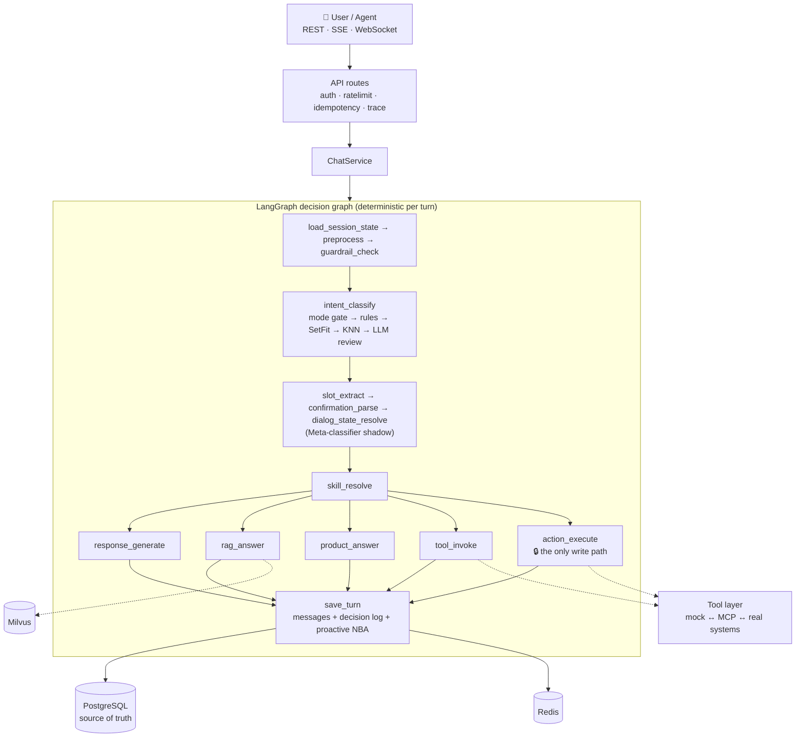

<div align="center">

# 🛎️ ai-cs-platform

**Production-grade multi-tenant AI customer-service agent platform**

Built around a LangGraph decision graph — every turn deterministic, replayable, safe by construction

[](https://www.python.org/)
[](https://fastapi.tiangolo.com/)
[](https://langchain-ai.github.io/langgraph/)
[](https://www.postgresql.org/)
[](https://redis.io/)
[](https://milvus.io/)
[](https://vuejs.org/)
[](#-quality)

[中文](./README.md) · [Quick start](#-quick-start) · [Architecture](#-architecture)

</div>

> ⚡ **Runs end-to-end with zero external API keys.** The AI layer (LLM / embeddings / MCP tools) degrades gracefully to rules / templates / mock when unconfigured — real model endpoints are an integration step, not a hard dependency.

---

## ✨ What it is

An AI customer-service backend built as an **engineering system**, not an LLM wrapper:

- 🧠 **The LLM never has direct write authority** — refunds / cancellations / address changes all pass a **confirmation gate** and a single idempotent write entry (`ActionExecutor`)
- 🔁 **Every turn is replayable** — per-turn decision log (intent evidence, retrieval trace, proactive actions, latency)
- 🛡️ **Safe by default** — injection defense, abuse grading, output guardrails, "price/stock never from RAG" red lines are structural
- 📉 **Degrades, never breaks** — timeouts and fallback paths on every external dependency

## 🎯 Capabilities

| | Capability | Notes |
|---|---|---|
| 🧭 | **Three decision axes** | Conversation Mode Gate (social/task/mixed/OOS, shared SetFit body) → intent axis (rule layer → SetFit → KNN → LLM second-opinion) → task-operation axis (Meta-classifier, shadow mode) |
| 💬 | **Dialog & tasks** | Multi-turn slot filling · state machine · task stack suspend/resume · multi-intent splitting · slot/switch guards |
| ✍️ | **Safe writes** | Confirmation gate + single write entry: atomic execution claim, replay protection, idempotency keys, independent audit |
| 📚 | **RAG / FAQ KB** | Milvus hybrid retrieval (vector + keyword RRF) · rerank · parent-child chunking · **refuse-don't-fabricate** · draft-review-publish ops flow |
| 🛒 | **Product** | Price/stock only from the product table (red line) · product advisor (hard-constraint filtering, explainable) · comparison |
| 📣 | **Proactive service (NBA)** | Rule-based Next Best Action: campaign mention + member onboarding — global suppression matrix (no marketing in refunds/complaints/confirm gates/negative emotion), frequency caps, rejection cooldown, shadow-first |
| 🧑‍💼 | **Human handoff** | Ticket lifecycle · context handoff package · agent APIs · real-time WebSocket both sides · CSAT loop |
| 🔐 | **Auth & multi-tenancy** | Per-tenant API keys (instant revocation) · scope separation · rate limiting · Idempotency-Key |
| 🔍 | **Observability** | Prometheus + alert rules + Grafana · Langfuse tracing · quality dashboard · data flywheel for retraining |
| 💰 | **Cost & experiments** | Semantic cache · per-tenant token budget breaker · model tier routing · deterministic A/B bucketing |
| 🖥️ | **Web console** | Vue 3: chat debugging with decision tags · agent workbench · KB/FAQ/product ops pages · per-turn decision log viewer |
| 🚢 | **Deployment** | Dockerfile + production compose · cron scheduler · MCP standard tool service · i18n foundation |

## 🏗 Architecture



## 🚀 Quick start

Requires **Python 3.12 + uv**, **PostgreSQL / Redis** (mandatory), **Milvus 2.5+** (optional — `KB_ENABLED=false` to skip).

```bash
docker compose up -d                  # PG + Redis (add --profile kb for Milvus)
cp .env.example .env                  # dev mode runs with zero config
uv sync
uv run alembic upgrade head
uv run uvicorn app.main:app --reload  # → http://localhost:8000
```

```bash
curl -X POST http://localhost:8000/api/chat/sessions/demo-1/messages \
  -H 'Content-Type: application/json' \
  -d '{"tenant_id":"t1","user_id":"u1","message":"我要退款，订单号 SO12345678"}'
```

Web console: `cd web && npm install && npm run dev` (:5173, proxies `/api`).

## ✅ Quality

```bash
uv run ruff check app tests scripts && uv run mypy app && uv run pytest
```

**ruff clean · mypy clean · 550+ tests passing.** Staged development (Stage 01–33), each stage documented under `docs/requirements/` with implementation records. Engineering guardrails built in: node write contracts, readonly tool whitelist metadata, model artifact fingerprint checks, production hard gates.

## ⚠️ Known limits

- Dev mode uses deterministic pseudo-vectors (`EMBEDDING_PROVIDER=hash`, forbidden in prod); retrieval / cache / gate thresholds need real embeddings + real-traffic calibration
- Real LLM paths are smoke-tested only; everything runs on rules/templates without a key (by design)
- Input-side understanding (intent training set, guardrail lexicon, slot regex) is Chinese-centric; i18n covers the output side
- A/B framework splits data and computes rates; significance conclusions require real traffic

## 🧰 Tech stack

`Python 3.12` · `FastAPI` · `SQLAlchemy 2.x async` · `Alembic` · `redis.asyncio` · `Pydantic v2` · `LangChain / LangGraph` · `SetFit` · `Milvus` · `Prometheus / Grafana` · `Langfuse` · `FastMCP` · `Vue 3 + Vite + Element Plus`

## 📄 License

Not yet specified.
