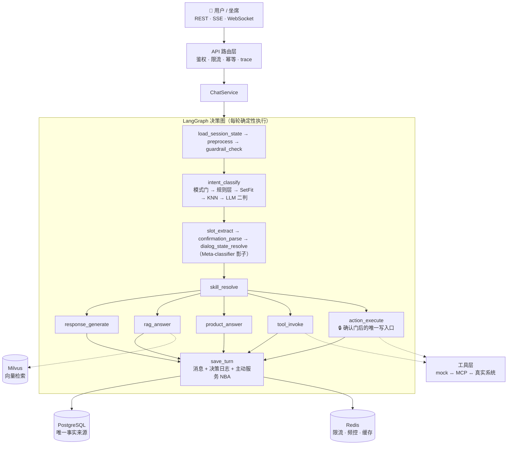

<div align="center">

# 🛎️ ai-cs-platform

**生产级多租户 AI 客服 Agent 平台**

以 LangGraph 决策图为核心 —— 每一轮对话确定性、可回放、默认安全

[](https://www.python.org/)
[](https://fastapi.tiangolo.com/)
[](https://langchain-ai.github.io/langgraph/)
[](https://www.postgresql.org/)
[](https://redis.io/)
[](https://milvus.io/)
[](https://vuejs.org/)
[](https://github.com/wxiangliang/ai-cs-platform/actions/workflows/ci.yml)
[](LICENSE)

[English](./README.en.md) · [快速开始](#-快速开始) · [架构](#-架构一图流) · [文档导航](#-文档导航)

</div>

> ⚡ **零外部 Key 即可端到端跑通。** AI 层（LLM / embedding / MCP 工具）未配置时自动降级为规则 / 模板 / mock——接真实模型端点是联调项，不是硬依赖。

---

## ✨ 它是什么

一个把「AI 客服」当**工程系统**而不是「大模型套壳」来做的后端平台：

- 🧠 **LLM 永远没有直接写权限**——退款 / 取消 / 改地址一律经过**确认门**和唯一幂等写入口（`ActionExecutor`）
- 🔁 **每一轮可回放**——逐轮决策日志（意图证据 / 检索轨迹 / 主动动作 / 延迟），`replay_trace` 一键复盘
- 🛡️ **默认安全**——注入防护、辱骂分级、输出护栏、价格库存禁走 RAG 等红线全部结构性落地
- 📉 **默认降级**——DB / Redis / LLM / Milvus / MCP 全部有超时与降级路径，故障不打断主链路

## 🎯 能力总览

| | 能力 | 说明 |
|---|---|---|
| 🧭 | **三模型三轴决策** | 对话模式门（闲聊/业务/混合/OOS，共享 SetFit body）→ 意图轴（规则控制层 → SetFit 30 类 → KNN 交叉验证 → LLM 难例二判）→ 任务操作轴（Meta-classifier 影子学习续接/切换/澄清） |
| 💬 | **对话与任务** | 多轮补槽 · 状态机 · 任务栈挂起/恢复 · 多意图切分 · 补槽守护/切换守护/软确认（Stage 26 决策加固） |
| ✍️ | **安全写操作** | 确认门 + 唯一写入口：原子拿执行权、防重放、幂等键下发、独立事务审计 |
| 📚 | **RAG / FAQ 知识库** | Milvus 混合检索（向量 + 关键词 RRF）· 重排 · 父子分块 · 歧义检测 · **拒答不编造**；草稿-审核-发布运营流 |
| 🛒 | **商品能力** | 价格/库存只走商品表（红线）· 选品顾问（硬约束过滤 + 可解释推荐）· 商品对比 |
| 📣 | **主动服务（NBA）** | 规则版 Next Best Action：活动引导 + 会员注册建议——全局抑制矩阵（投诉/退款/确认门/负面情绪禁营销）· 频控 · 拒绝冷却 · 影子先行 |
| 🧑‍💼 | **人工接管** | 工单生命周期 · 上下文移交包 · 坐席 API · 双端实时 WebSocket · CSAT 闭环 |
| 🔐 | **鉴权与多租户** | 每租户 API Key（即时吊销）· scope 分离 · 滑动窗口限流 · Idempotency-Key |
| 🔍 | **可观测** | Prometheus 指标 + 告警规则 + Grafana 看板 · Langfuse 链路追踪 · 质量看板物化视图 · 数据回流重训闭环 |
| 💰 | **成本与实验** | 语义缓存 · 租户 token 预算熔断 · 模型分级路由 · A/B 确定性分桶 |
| 🖥️ | **Web 控制台** | Vue 3 测试控制台：对话调试（决策标签）· 坐席工作台 · 知识库/FAQ/商品运营页 · 观测分析（32 接口全覆盖） |
| 🚢 | **部署** | Dockerfile + compose 生产编排 · cron 调度器 · MCP 标准工具服务 · i18n 地基 |

## 🏗 架构一图流



**三条独立决策轴**（互不越界，测试锁定）：

| 轴 | 回答的问题 | 承担者 |
|---|---|---|
| 模式轴 | 这句话是闲聊、业务、混合还是域外？ | Conversation Mode Gate（Stage 30） |
| 意图轴 | 业务部分具体想做什么？ | 规则层 + SetFit + KNN + LLM 二判 |
| 策略轴 | 主任务办完后，是否适合主动引导？ | NBA 规则策略（Stage 31/33，影子先行） |

## 📁 目录结构

<details>
<summary><b>点开看仓库布局（详版见 <code>CLAUDE.md</code>）</b></summary>

```text
ai-cs-platform/
├── app/                       # FastAPI 后端
│   ├── api/routes/            # 接入层：chat(SSE/WS)/handoff/cases/events/kb/product/observe/metrics
│   ├── services/              # 应用服务：chat/handoff/notify/case(SLA)/event/journey
│   ├── chat/                  # 聊天主链路
│   │   ├── graph/             # LangGraph 决策图（8 线性节点 + 5 回复分支 + 节点写契约）
│   │   ├── intent/            # 混合意图：规则控制层 + SetFit + KNN + LLM 二判 + Meta 影子
│   │   ├── mode/              # 对话模式门：闲聊/业务/混合/OOS（共享 SetFit body）
│   │   ├── guidelines/        # 行为准则层（Parlant 借鉴：condition-action 动态注入）
│   │   ├── proactive/         # 主动服务：NBA + 活动池（抑制矩阵/频控/拒绝冷却）
│   │   ├── guardrail/ tools/ actions/ agents/ slots/ state/ skills/ memory/ llm/ cache/
│   ├── kb/                    # RAG：解析管道/结构感知切分/混合检索/重排/生成
│   ├── core/                  # 配置/鉴权/限流/幂等/指标/追踪/身份等级/i18n
│   ├── models/ repositories/  # ORM（18 表）与数据访问层
│   └── product/ experiments/  # 商品库 / A/B 实验
├── skills/                    # 意图技能声明（35 个 md，Loader 启动加载）
│   └── capabilities/          # 能力规格（策略轴，不加载；含落点对照）
├── configs/                   # 运行时配置：活动池/补偿政策/行为准则（example 入库）
├── web/                       # Vue 3 测试控制台（对话调试/坐席工作台/知识库运营/观测）
├── deploy/                    # Dockerfile/生产 compose/监控（Prometheus+Grafana）/cron 调度器
├── scripts/                   # 训练/密钥/回流/回放/SLA 巡检/缺口挖掘等 CLI（30+）
├── docs/                      # 需求（stage-01~40）/架构/API/数据库/运维/评估报告
├── tests/                     # 按 stage 分目录 + 意图/多意图/RAG 评估门禁（620+）
└── alembic/ + sql/ddl/        # 异步迁移 + 建表 SQL 生成物
```

</details>

## 🚀 快速开始

依赖：**Python 3.12 + uv** · **PostgreSQL / Redis**（必需）· **Milvus 2.5+**（可选，`KB_ENABLED=false` 关闭）

```bash
docker compose up -d                  # PG + Redis（--profile kb 加 Milvus）
cp .env.example .env                  # 开发模式零配置可跑
uv sync                               # 安装依赖
uv run alembic upgrade head           # 建表
uv run uvicorn app.main:app --reload  # 启动 → http://localhost:8000
```

发一条消息试试（开发模式，tenant 从请求体取）：

```bash
curl -X POST http://localhost:8000/api/chat/sessions/demo-1/messages \
  -H 'Content-Type: application/json' \
  -d '{"tenant_id":"t1","user_id":"u1","message":"我要退款，订单号 SO12345678"}'
```

<details>
<summary><b>🖥️ 启动 Web 测试控制台（Vue 3）</b></summary>

```bash
cd web && npm install && npm run dev   # :5173，/api 自动代理到 :8000
```

对话调试（AI 回复附意图/状态/决策标签）、坐席工作台、知识库/FAQ/商品运营页、
逐轮决策日志查看，一应俱全。部署见 `docs/ops/web_console_deploy.md`。

</details>

<details>
<summary><b>📚 启用知识库（开发伪向量）</b></summary>

```bash
# .env：KB_ENABLED=true  EMBEDDING_PROVIDER=hash  FAQ_HIT_THRESHOLD=0.6  RAG_MIN_SCORE=0.2
uv run python -m app.kb.reindex --tenant t1
```

</details>

## ✅ 质量与工程纪律

```bash
uv run ruff check app tests scripts && uv run mypy app && uv run pytest
```

- **ruff 干净 · mypy 干净 · 620+ 项测试通过**（CI：`.github/workflows/ci.yml`，含意图 / 多意图 / RAG 评估门禁）
- 按 **Stage 分阶段推进**，每个阶段有需求文档 + 实现记录（`docs/requirements/`）
- 节点写契约执法、工具只读白名单元数据化、模型产物指纹校验等工程护栏内建
- 生产硬门禁：`APP_ENV=prod` 时鉴权/调试/弱口令缺项**拒绝启动**

## 📚 文档导航

| 入口 | 内容 |
|---|---|
| [`docs/architecture/implementation_summary.md`](docs/architecture/implementation_summary.md) | **给人看的实现总结**（新人上手首选） |
| [`docs/architecture/system_overview.md`](docs/architecture/system_overview.md) | 分层架构与 LangGraph 主链路 |
| [`docs/architecture/roadmap.md`](docs/architecture/roadmap.md) | 路线图（阶段状态 + backlog） |
| [`docs/chat/intent_taxonomy.md`](docs/chat/intent_taxonomy.md) | 意图体系（单一事实来源） |
| [`docs/api/chat_api.md`](docs/api/chat_api.md) | API 契约（REST / SSE / WebSocket） |
| [`docs/ops/`](docs/ops/) | 部署 · 监控 · 运维手册 · 质量 SQL |
| [`CLAUDE.md`](CLAUDE.md) / [`AGENTS.md`](AGENTS.md) | 阶段进度全景 / AI 协作规则 |

## 🗺 阶段历程

<details>
<summary><b>Stage 01–40 全部已实现，点开看分组明细</b></summary>

| 阶段 | 主题 |
|------:|------|
| 01–04 | 基础框架 · 聊天核心表 · 主链路 · LLM 接入（SetFit 语义分类） |
| 05–06 | 工具层与确认门 · RAG/FAQ/向量库（解析管道 / 检索路由 / 检索 v2） |
| 07–09 | 人工接管与工单 · 鉴权多租户 · 可观测与评估平台 |
| 10–12 | 多意图/任务治理/记忆 · MCP 工具服务 · Langfuse 追踪 |
| 13–16 | 生产加固 · 内容安全护栏 · 体验闭环（WS/CSAT）· 知识库运营后台 |
| 17–19 | LLM 成本控制 · A/B 实验框架 · 多语言地基 |
| 20–23 | 记忆摘要 v2 · 智能澄清 · 只读诊断 agent · 对话方向纠偏 |
| 24–25 | 部署编排（Docker/cron）· 监控告警（Prometheus/Grafana） |
| 26–27 | 意图决策加固（补槽/切换守护/margin 路由）· Meta-classifier 影子 |
| 28–29 | Web 测试控制台（Vue 3）· 控制台全接口覆盖 |
| 30–33 | 对话模式门 · 主动服务 NBA · 选品顾问/商品对比 · 会员注册引导 |
| 34–37 | Case 工单与 SLA（含 Service Recovery）· 身份核验分级 IAL · 事件驱动主动客服 · 知识缺口发现+质量 Scorecard |
| 38–40 | 客户旅程 · 预约与资源调度 · 行为准则层（Parlant 借鉴） |

另有横向工程专项：全链路 Review 加固、节点写契约、生产就绪审计等，详见 `CLAUDE.md`。

</details>

## ⚠️ 已知边界

- **真实模型标定**：开发模式用确定性伪向量（`EMBEDDING_PROVIDER=hash`，生产禁用）；检索阈值、语义缓存、预算分级、Mode Gate/Meta 阈值均需真实 embedding + 真实流量标定
- **LLM 端点**：润色 / 二判 / 澄清仅冒烟验证，无 Key 时全部走规则/模板（设计如此）
- **输入侧多语言**：i18n 覆盖输出文案；意图训练集 / 护栏词表 / 槽位正则仍以中文为主
- **A/B 显著性**：框架切数据、算比率，显著性结论留给真实流量

## 🧰 技术栈

`Python 3.12` · `FastAPI` · `SQLAlchemy 2.x async` · `Alembic` · `redis.asyncio` · `Pydantic v2` · `LangChain / LangGraph` · `SetFit` · `Milvus` · `Prometheus / Grafana` · `Langfuse` · `FastMCP` · `Vue 3 + Vite + Element Plus`

## 📄 License

[Apache License 2.0](LICENSE)

---

<div align="center">
<sub>按 Stage 演进的工程化 AI 客服平台 —— 规则先行，模型增强，安全兜底。</sub>
</div>
